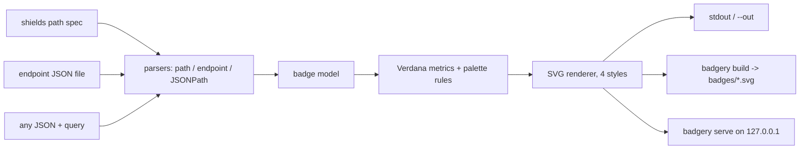

# badgery

[English](README.md) | [中文](README.zh.md) | [日本語](README.ja.md)

[](LICENSE) [](Cargo.toml)  [](CONTRIBUTING.md)

**エアギャップ CI のためのオープンソース shields 風 SVG バッジジェネレーター——ローカル JSON エンドポイントを入力にバッジを出力、ネットワーク呼び出しは一切なし。**


```bash
git clone https://github.com/JaydenCJ/badgery.git && cargo install --path badgery
```

## なぜ badgery？

社内リポジトリやエアギャップ環境のリポジトリにもバッジは欲しい——カバレッジ、バージョン、スキャン結果——のに、既存のどの道も行き止まりだ。ネットワークが遮断されていれば `img.shields.io` は論外。shields のセルフホストは、高さ 20 ピクセルの長方形を描くためだけに数百の npm 依存を抱えた Node サービスを運用することを意味する。小さなバッジライブラリは独自構文を発明していて、shields で培った知識が何も通用しない。badgery は std のみに依存する単一の Rust バイナリで、既に使っている shields の約束事——`label-message-color` のパス構文とエスケープ規則、バイト単位で互換のエンドポイント JSON schema、寸分違わぬパレットの 16 進値とテキストジオメトリ——をそのまま保ち、すべてをローカルファイルから描画する。外向きの接続は決して開かない：フォントのためにも、ロゴのためにも、テレメトリのためにも。バイナリを隔離環境に持ち込めば、バッジ URL も仕様ファイルも指の記憶もそのまま動く。

|  | badgery | セルフホスト shields | anybadge | badge-maker |
|---|---|---|---|---|
| ランタイム | 静的バイナリ 1 個 | Node サービス + npm 依存ツリー | Python | Node ライブラリ |
| 実行時依存 | 0 crate（std のみ） | 数百の npm パッケージ | 1 パッケージ | npm パッケージ |
| 完全オフライン動作 | はい、設計上保証 | 概ね可（フォント/ロゴ次第） | はい | はい |
| shields パス構文（`a-b-c`、`--` エスケープ） | はい | はい | いいえ（独自フラグ） | いいえ（JS API） |
| shields エンドポイント JSON schema | はい | はい | いいえ | いいえ |
| 任意 JSON からの動的バッジ（JSONPath） | はい（`query`） | はい（ホスト版のみ） | いいえ | いいえ |
| マニフェストからの一括ビルド | はい（`build`） | いいえ | いいえ | いいえ |
| `` 用のローカル HTTP サーバー | はい、ループバックのみ | はい（それが製品そのもの） | いいえ | いいえ |

<sub>依存数は 2026-07-13 に確認：`shields` の `package.json` は 150+ の直接本番依存を列挙；`anybadge` は `packaging` が必要；badgery の `[dependencies]` セクションは空。</sub>

## 特長

- **shields の指の記憶がそのまま効く** — `badgery static build-passing-brightgreen` は URL パス構文を完全互換で受け付ける。`--`/`__`/`_` エスケープ、メッセージのみのバッジ、名前付き色、エイリアス（`critical`、`success`）、裸の 16 進も含めて。
- **エンドポイントファイルはバイト互換** — shields のエンドポイントバッジ用にホストするはずだった JSON（`schemaVersion`、`label`、`message`、`isError` など）を同じ上書き規則・エラー規則でローカル描画し、厳格に検証するので壊れた CI データは大きな音を立てて落ちる。
- **どんな JSON もバッジになる** — `badgery query release.json '$.tests.passed' --suffix ' passed'` は JSONPath サブセット（`$.key`、`["key"]`、`[0]`、`[-1]`）で任意ファイルから値を 1 つ取り出す。`--prefix`/`--suffix` と綺麗な整数フォーマット付き。
- **マニフェスト 1 枚でバッジの壁を丸ごと** — `badgery.json` に全バッジを宣言し、CI で `badgery build` を実行して `badges/*.svg` をコミット。部分的な失敗では描けるものは描き、バッジごとの理由と共に非ゼロで終了する。
- **URL が欲しいときはサーバーも** — `badgery serve` は 127.0.0.1 上で `/badge/<spec>.svg`、`/endpoint?file=…`、`/query?file=…&query=…` に応答。クエリパラメータでの上書き、パストラバーサル防御、壊れた画像アイコンの代わりの赤いエラーバッジを備える。
- **忠実な描画、バイト単位の決定性** — shields のパレット 16 進値、輝度しきい値、Verdana メトリクス、`textLength` 固定を 4 スタイル（`flat`、`flat-square`、`plastic`、`for-the-badge`）で再現。同じ入力からは常に同じ SVG。

## クイックスタート

インストール（Rust 1.75+ が必要）：

```bash
git clone https://github.com/JaydenCJ/badgery.git && cargo install --path badgery
```

任意の JSON ファイルからバッジを描画——ここではリリースマニフェストのバージョン欄：

```bash
badgery query examples/release.json '$.version' --label version --prefix v --color blue
```

出力（実測キャプチャ；要点の行のみ抜粋——完全なファイルは 16 行の独立 SVG）：

```text
<svg xmlns="http://www.w3.org/2000/svg" width="95" height="20" role="img" aria-label="version: v1.4.2">
  <title>version: v1.4.2</title>
    <rect width="49.8" height="20" fill="#555"/>
    <rect x="49.8" width="45.2" height="20" fill="#007ec6"/>
    <text x="724" y="140" fill="#fff" transform="scale(.1)" textLength="352">v1.4.2</text>
</svg>
```

あるいはマニフェストに宣言したバッジ一式をまとめてビルド（`examples/badgery.json` 参照）：

```bash
cd examples && badgery build
```

```text
wrote ./badges/build.svg
wrote ./badges/coverage.svg
wrote ./badges/version.svg
wrote ./badges/tests.svg
built 4/4 badges in ./badges
```

生成されたファイルは README から相対リンクで参照するだけ——サーバーも、ネットワークも不要。

## shields 互換 URL の提供

`badgery serve --root ci --addr 127.0.0.1:8331` は、`` URL を求める wiki やダッシュボード向けに同じ 3 種のソースを HTTP で公開する。待ち受けるだけで（既定はループバック）、読むのは `--root` 配下のファイルだけ。

| ルート | 描画対象 | 追加パラメータ |
|---|---|---|
| `/badge/<label>-<message>-<color>.svg` | パスから生成する静的バッジ | `?style=`、`?label=`、`?labelColor=`、`?color=` |
| `/endpoint?file=ci/coverage.json` | ルート配下のエンドポイント schema ファイル | 同じ上書き群；`isError` は赤のまま |
| `/query?file=meta.json&query=$.version` | 任意 JSON ファイルの値 1 つ | `?label=`、`?prefix=`、`?suffix=`、`?style=` |
| `/health` | `ok` —— 死活監視 | — |

壊れた・存在しないデータファイルは HTTP 200 の赤い**エラーバッジ**として返り、パイプラインの故障が壊れた画像アイコンではなくページ上に現れる。トラバーサル試行（`file=../…`）は 400 で拒否。詳細：[docs/endpoint-format.md](docs/endpoint-format.md) と [docs/manifest.md](docs/manifest.md)。

## 色とスタイル

| 入力 | 受け付ける値 | 備考 |
|---|---|---|
| 名前付き色 | `brightgreen` `green` `yellowgreen` `yellow` `orange` `red` `blue` `grey` `lightgrey` | shields の原典 16 進値；`gray` 綴りも可 |
| 意味的エイリアス | `success` `important` `critical` `informational` `inactive` | パレットに対応付け |
| 16 進 | `4c1`、`#4c1`、`007ec6`、`#007EC6` | 3 桁または 6 桁、`#` は省略可 |
| スタイル | `flat`（既定）`flat-square` `plastic` `for-the-badge` | `social` は対象外（ロゴ埋め込みが必要） |

認識できない色は失敗せず既定値へフォールバックする——shields と同じ寛容さ。テキスト幅は ASCII に内蔵 Verdana メトリクスを、CJK などの広い文字には意図的に余裕を持たせたフォールバックを使い、すべての `<text>` が `textLength` を持つため、Verdana のない環境でもバッジがはみ出すことはない。

## 検証

このリポジトリは CI を一切同梱しない。上記の主張はすべてローカル実行で検証している：`cargo test`（ユニット 80 + CLI 統合 9）と `bash scripts/smoke.sh`——後者は 5 つのサブコマンドと HTTP サーバーをエンドツーエンドで実行し、`SMOKE OK` を出力しなければならない。

## アーキテクチャ



## ロードマップ

- [x] コアエンジン：shields パス構文、エンドポイント schema、JSONPath クエリ、4 スタイル、マニフェストビルド、ループバックサーバー
- [ ] `data:` URI によるロゴ埋め込み（ネットワークはゼロのまま）
- [ ] 単一の広グリフフォールバックに代わる Latin-1 / CJK の実メトリクステーブル
- [ ] `query` バッジの TOML / YAML データソース対応
- [ ] エアギャップ持ち込みを楽にするプラットフォーム別ビルド済み静的バイナリ

全リストは [open issues](https://github.com/JaydenCJ/badgery/issues) を参照。

## コントリビュート

コントリビュート歓迎——[CONTRIBUTING.md](CONTRIBUTING.md) を読み、[good first issue](https://github.com/JaydenCJ/badgery/issues?q=is%3Aissue+is%3Aopen+label%3A%22good+first+issue%22) から始めるか、[discussion](https://github.com/JaydenCJ/badgery/discussions) を立ててほしい。

## ライセンス

[MIT](LICENSE)
