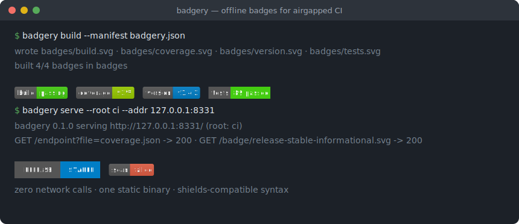
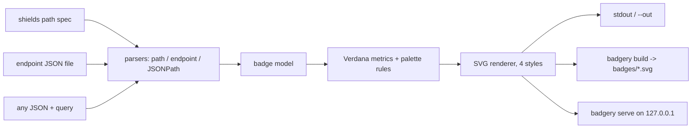

# badgery

[English](README.md) | [中文](README.zh.md) | [日本語](README.ja.md)

[](LICENSE) [](Cargo.toml)  [](CONTRIBUTING.md)

**Open-source shields-style SVG badge generator for airgapped CI — local JSON endpoints in, badges out, zero network calls ever.**



```bash
git clone https://github.com/JaydenCJ/badgery.git && cargo install --path badgery
```

## Why badgery?

Internal and airgapped repos want badges too — coverage, version, scan status — but every path to them is wrong. `img.shields.io` is a hard no when the network is sealed; self-hosting shields means running a Node service with hundreds of npm dependencies just to draw a 20-pixel rectangle; and the small badge libraries invent their own syntax, so nothing you know from shields carries over. badgery is one std-only Rust binary that keeps the shields conventions you already use — the `label-message-color` path syntax with its escaping rules, the endpoint JSON schema byte-for-byte, the exact palette hex values and text geometry — and renders everything from local files. It never opens an outbound connection: not for fonts, not for logos, not for telemetry. Drop the binary into the sealed environment and your badge URLs, specs and reflexes all still work.

|  | badgery | self-hosted shields | anybadge | badge-maker |
|---|---|---|---|---|
| Runtime | one static binary | Node server + npm tree | Python | Node library |
| Runtime dependencies | 0 crates (std only) | hundreds of npm packages | 1 package | npm package |
| Works fully offline | yes, by construction | mostly (fonts/logos vary) | yes | yes |
| shields path syntax (`a-b-c`, `--` escapes) | yes | yes | no (own flags) | no (JS API) |
| shields endpoint JSON schema | yes | yes | no | no |
| Dynamic badge from any JSON (JSONPath) | yes (`query`) | yes (hosted only) | no | no |
| Batch build from a manifest | yes (`build`) | no | no | no |
| Local HTTP server for `` URLs | yes, loopback | yes (that is the product) | no | no |

<sub>Dependency counts checked 2026-07-13: `shields` lists 150+ direct production dependencies in its `package.json`; `anybadge` needs `packaging`; badgery's `[dependencies]` section is empty.</sub>

## Features

- **Your shields muscle memory works** — `badgery static build-passing-brightgreen` accepts the exact URL path syntax including `--`/`__`/`_` escapes, message-only badges, named colors, aliases (`critical`, `success`) and bare hex.
- **Endpoint files are byte-compatible** — the JSON you would host for shields' endpoint badge (`schemaVersion`, `label`, `message`, `isError`, …) renders locally with the same override and error rules, validated strictly so broken CI data fails loudly.
- **Any JSON becomes a badge** — `badgery query release.json '$.tests.passed' --suffix ' passed'` pulls one value out of any file with a JSONPath subset (`$.key`, `["key"]`, `[0]`, `[-1]`), with `--prefix`/`--suffix` and clean integer formatting.
- **One manifest, whole badge wall** — declare every badge in `badgery.json`, run `badgery build` in CI, commit `badges/*.svg`; partial failures render what they can and exit non-zero with per-badge reasons.
- **A server when you want URLs** — `badgery serve` answers `/badge/<spec>.svg`, `/endpoint?file=…` and `/query?file=…&query=…` on 127.0.0.1, with query-parameter overrides, path-traversal protection and red error badges instead of broken images.
- **Faithful rendering, deterministic bytes** — shields' palette hex values, brightness threshold, Verdana metrics and `textLength` anchoring in four styles (`flat`, `flat-square`, `plastic`, `for-the-badge`); the same input always yields the same SVG.

## Quickstart

Install (requires Rust 1.75+):

```bash
git clone https://github.com/JaydenCJ/badgery.git && cargo install --path badgery
```

Render a badge from any JSON file — here the version field of a release manifest:

```bash
badgery query examples/release.json '$.version' --label version --prefix v --color blue
```

Output (captured; abridged to the interesting lines — the full file is a 16-line standalone SVG):

```text
<svg xmlns="http://www.w3.org/2000/svg" width="95" height="20" role="img" aria-label="version: v1.4.2">
  <title>version: v1.4.2</title>
    <rect width="49.8" height="20" fill="#555"/>
    <rect x="49.8" width="45.2" height="20" fill="#007ec6"/>
    <text x="724" y="140" fill="#fff" transform="scale(.1)" textLength="352">v1.4.2</text>
</svg>
```

Or build the whole badge set declared in a manifest (see `examples/badgery.json`):

```bash
cd examples && badgery build
```

```text
wrote ./badges/build.svg
wrote ./badges/coverage.svg
wrote ./badges/version.svg
wrote ./badges/tests.svg
built 4/4 badges in ./badges
```

Reference the files from your README with relative links — no server, no network.

## Serving shields-compatible URLs

`badgery serve --root ci --addr 127.0.0.1:8331` exposes the same three sources over HTTP for wikis and dashboards that want `` URLs. It only listens (loopback by default) and only reads files under `--root`.

| Route | Renders | Extras |
|---|---|---|
| `/badge/<label>-<message>-<color>.svg` | static badge from the path | `?style=`, `?label=`, `?labelColor=`, `?color=` |
| `/endpoint?file=ci/coverage.json` | endpoint-schema file under the root | same overrides; `isError` stays red |
| `/query?file=meta.json&query=$.version` | one value from any JSON file | `?label=`, `?prefix=`, `?suffix=`, `?style=` |
| `/health` | `ok` — liveness probe | — |

Broken or missing data files come back as a red **error badge** with HTTP 200, so a failed pipeline shows up on the page instead of as a broken image icon; traversal attempts (`file=../…`) are refused with 400. Details: [docs/endpoint-format.md](docs/endpoint-format.md) and [docs/manifest.md](docs/manifest.md).

## Colors and styles

| Input | Accepted values | Notes |
|---|---|---|
| Named colors | `brightgreen` `green` `yellowgreen` `yellow` `orange` `red` `blue` `grey` `lightgrey` | shields' exact hex values; `gray` spellings too |
| Semantic aliases | `success` `important` `critical` `informational` `inactive` | map onto the palette |
| Hex | `4c1`, `#4c1`, `007ec6`, `#007EC6` | 3 or 6 digits, `#` optional |
| Styles | `flat` (default) `flat-square` `plastic` `for-the-badge` | `social` is out of scope (needs embedded logos) |

Unrecognized colors fall back to the default instead of failing — the same forgiving behavior as shields. Text width uses embedded Verdana metrics for ASCII and a deliberately generous fallback for CJK and other wide characters, and every `<text>` carries `textLength`, so badges never overflow even where Verdana is absent.

## Verification

This repository ships no CI; every claim above is verified by local runs: `cargo test` (80 unit + 9 CLI integration tests) and `bash scripts/smoke.sh`, which exercises all five subcommands plus the HTTP server end to end and must print `SMOKE OK`.

## Architecture



## Roadmap

- [x] Core engine: shields path syntax, endpoint schema, JSONPath queries, four styles, manifest build, loopback server
- [ ] Embedded logos via `data:` URIs (still zero network)
- [ ] Real metric tables for Latin-1 and CJK instead of one wide-glyph fallback
- [ ] TOML and YAML data sources for `query` badges
- [ ] Prebuilt static binaries per platform for easier airgap ingestion

See the [open issues](https://github.com/JaydenCJ/badgery/issues) for the full list.

## Contributing

Contributions are welcome — see [CONTRIBUTING.md](CONTRIBUTING.md), start with a [good first issue](https://github.com/JaydenCJ/badgery/issues?q=is%3Aissue+is%3Aopen+label%3A%22good+first+issue%22) or open a [discussion](https://github.com/JaydenCJ/badgery/discussions).

## License

[MIT](LICENSE)
