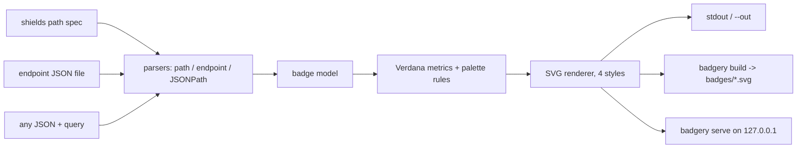

# badgery

[English](README.md) | [中文](README.zh.md) | [日本語](README.ja.md)

[](LICENSE) [](Cargo.toml)  [](CONTRIBUTING.md)

**面向物理隔离 CI 的开源 shields 风格 SVG 徽章生成器——本地 JSON 端点进、徽章出，永不发起网络调用。**


```bash
git clone https://github.com/JaydenCJ/badgery.git && cargo install --path badgery
```

## 为什么选 badgery？

内网与物理隔离的仓库同样需要徽章——覆盖率、版本号、扫描状态——但现有每条路都走不通。网络被封死时 `img.shields.io` 直接出局；自建 shields 意味着为了画一个 20 像素高的矩形去运行一个背着上百个 npm 依赖的 Node 服务；而各种小型徽章库又各自发明语法，你在 shields 上积累的一切都无法迁移。badgery 是一个只依赖 std 的 Rust 单二进制，完整保留你已经在用的 shields 约定——`label-message-color` 路径语法及其转义规则、逐字节兼容的端点 JSON schema、一模一样的调色板十六进制值与文字几何——并且全部从本地文件渲染。它永远不会发起出站连接：不为字体、不为 logo、也不为遥测。把二进制拷进隔离环境，你的徽章 URL、规格文件和肌肉记忆全部照常工作。

|  | badgery | 自建 shields | anybadge | badge-maker |
|---|---|---|---|---|
| 运行时 | 一个静态二进制 | Node 服务 + npm 依赖树 | Python | Node 库 |
| 运行时依赖 | 0 个 crate（仅 std） | 数百个 npm 包 | 1 个包 | npm 包 |
| 完全离线可用 | 是，从设计上保证 | 基本可以（字体/logo 视情况） | 是 | 是 |
| shields 路径语法（`a-b-c`、`--` 转义） | 是 | 是 | 否（自有参数） | 否（JS API） |
| shields 端点 JSON schema | 是 | 是 | 否 | 否 |
| 从任意 JSON 取值的动态徽章（JSONPath） | 是（`query`） | 是（仅托管版） | 否 | 否 |
| 按清单批量构建 | 是（`build`） | 否 | 否 | 否 |
| 供 `` 引用的本地 HTTP 服务 | 是，仅回环 | 是（这正是其产品形态） | 否 | 否 |

<sub>依赖数量核查于 2026-07-13：`shields` 的 `package.json` 列出 150+ 个直接生产依赖；`anybadge` 需要 `packaging`；badgery 的 `[dependencies]` 一节为空。</sub>

## 功能

- **你的 shields 肌肉记忆直接生效** — `badgery static build-passing-brightgreen` 接受完全相同的 URL 路径语法，包括 `--`/`__`/`_` 转义、纯消息徽章、命名颜色、别名（`critical`、`success`）以及裸十六进制。
- **端点文件逐字节兼容** — 你原本为 shields 端点徽章托管的那份 JSON（`schemaVersion`、`label`、`message`、`isError` 等）可直接在本地渲染，覆盖规则与错误规则一致，并做严格校验，让坏掉的 CI 数据大声失败。
- **任意 JSON 都能变成徽章** — `badgery query release.json '$.tests.passed' --suffix ' passed'` 用 JSONPath 子集（`$.key`、`["key"]`、`[0]`、`[-1]`）从任意文件中取出一个值，支持 `--prefix`/`--suffix` 与干净的整数格式化。
- **一份清单，整面徽章墙** — 在 `badgery.json` 里声明所有徽章，CI 里跑 `badgery build`，提交 `badges/*.svg`；部分失败时能渲染的照常渲染，并带着逐徽章原因以非零码退出。
- **需要 URL 时也有服务器** — `badgery serve` 在 127.0.0.1 上应答 `/badge/<spec>.svg`、`/endpoint?file=…` 与 `/query?file=…&query=…`，支持查询参数覆盖、路径穿越防护，并用红色错误徽章取代碎图标。
- **忠实渲染、字节级确定性** — shields 的调色板十六进制、亮度阈值、Verdana 字宽与 `textLength` 锚定，覆盖四种样式（`flat`、`flat-square`、`plastic`、`for-the-badge`）；相同输入永远产出相同 SVG。

## 快速上手

安装（需要 Rust 1.75+）：

```bash
git clone https://github.com/JaydenCJ/badgery.git && cargo install --path badgery
```

从任意 JSON 文件渲染徽章——这里取发布清单里的版本字段：

```bash
badgery query examples/release.json '$.version' --label version --prefix v --color blue
```

输出（真实截取；只保留关键行——完整文件是 16 行的独立 SVG）：

```text
<svg xmlns="http://www.w3.org/2000/svg" width="95" height="20" role="img" aria-label="version: v1.4.2">
  <title>version: v1.4.2</title>
    <rect width="49.8" height="20" fill="#555"/>
    <rect x="49.8" width="45.2" height="20" fill="#007ec6"/>
    <text x="724" y="140" fill="#fff" transform="scale(.1)" textLength="352">v1.4.2</text>
</svg>
```

或者按清单一次构建整套徽章（见 `examples/badgery.json`）：

```bash
cd examples && badgery build
```

```text
wrote ./badges/build.svg
wrote ./badges/coverage.svg
wrote ./badges/version.svg
wrote ./badges/tests.svg
built 4/4 badges in ./badges
```

在 README 里用相对链接引用这些文件即可——不要服务器，不要网络。

## 提供 shields 兼容的 URL

`badgery serve --root ci --addr 127.0.0.1:8331` 把同样的三种数据源以 HTTP 形式暴露给需要 `` URL 的 wiki 和看板。它只监听（默认回环），也只读取 `--root` 之下的文件。

| 路由 | 渲染内容 | 附加参数 |
|---|---|---|
| `/badge/<label>-<message>-<color>.svg` | 由路径生成的静态徽章 | `?style=`、`?label=`、`?labelColor=`、`?color=` |
| `/endpoint?file=ci/coverage.json` | 根目录下的端点 schema 文件 | 同样的覆盖参数；`isError` 保持红色 |
| `/query?file=meta.json&query=$.version` | 任意 JSON 文件中的一个值 | `?label=`、`?prefix=`、`?suffix=`、`?style=` |
| `/health` | `ok` —— 存活探针 | — |

数据文件损坏或缺失时会以 HTTP 200 返回红色**错误徽章**，让流水线故障出现在页面上而不是变成碎图标；路径穿越尝试（`file=../…`）一律以 400 拒绝。详见：[docs/endpoint-format.md](docs/endpoint-format.md) 与 [docs/manifest.md](docs/manifest.md)。

## 颜色与样式

| 输入 | 可接受的值 | 说明 |
|---|---|---|
| 命名颜色 | `brightgreen` `green` `yellowgreen` `yellow` `orange` `red` `blue` `grey` `lightgrey` | shields 的原版十六进制；也接受 `gray` 拼写 |
| 语义别名 | `success` `important` `critical` `informational` `inactive` | 映射到调色板 |
| 十六进制 | `4c1`、`#4c1`、`007ec6`、`#007EC6` | 3 或 6 位，`#` 可省略 |
| 样式 | `flat`（默认）`flat-square` `plastic` `for-the-badge` | `social` 不在范围内（需要内嵌 logo） |

无法识别的颜色会回退到默认值而不是报错——与 shields 一样宽容。文字宽度对 ASCII 使用内嵌的 Verdana 字宽表，对 CJK 等宽字符使用刻意放宽的回退值，且每个 `<text>` 都带 `textLength`，因此即使系统没有 Verdana，徽章也绝不会溢出。

## 验证

本仓库不携带任何 CI；上文的每一条声明都由本地运行验证：`cargo test`（80 个单元测试 + 9 个 CLI 集成测试）以及 `bash scripts/smoke.sh`——后者端到端跑遍五个子命令和 HTTP 服务器，必须打印 `SMOKE OK`。

## 架构



## 路线图

- [x] 核心引擎：shields 路径语法、端点 schema、JSONPath 查询、四种样式、清单构建、回环服务器
- [ ] 通过 `data:` URI 内嵌 logo（依旧零网络）
- [ ] 用真实字宽表覆盖 Latin-1 与 CJK，替换单一宽字符回退值
- [ ] `query` 徽章支持 TOML 与 YAML 数据源
- [ ] 提供各平台预编译静态二进制，方便隔离环境引入

完整列表见 [open issues](https://github.com/JaydenCJ/badgery/issues)。

## 参与贡献

欢迎贡献——请阅读 [CONTRIBUTING.md](CONTRIBUTING.md)，从 [good first issue](https://github.com/JaydenCJ/badgery/issues?q=is%3Aissue+is%3Aopen+label%3A%22good+first+issue%22) 入手，或发起一个 [discussion](https://github.com/JaydenCJ/badgery/discussions)。

## 许可证

[MIT](LICENSE)
